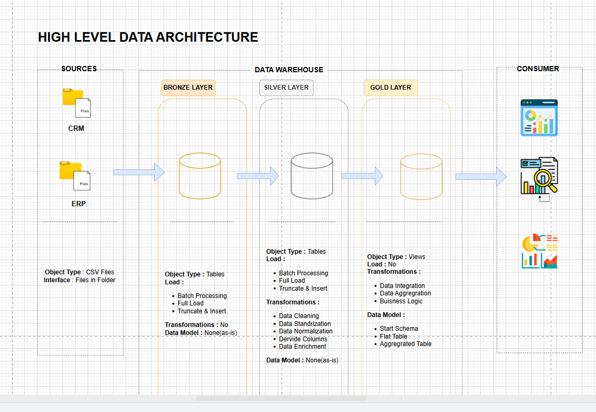

# SQL Data Warehouse Project 🚀

## 📌 Project Overview

This project demonstrates the design and implementation of a modern **Data Warehouse** using **SQL Server** following the **Medallion Architecture** approach.

The warehouse is divided into three layers:

- 🥉 **Bronze Layer** → Raw data ingestion
- 🥈 **Silver Layer** → Data cleaning and transformation
- 🥇 **Gold Layer** → Business-ready analytical model

The main goal of this project is to transform raw source data into clean, reliable, and analytics-ready data that can support reporting, dashboards, and business decision-making.

---

# 🏗️ Data Architecture

This project follows the **3-Layer Medallion Architecture**.

```text
                Source Files (CSV)
                        │
                        ▼
              ┌─────────────────┐
              │   Bronze Layer  │
              │ Raw Ingestion   │
              └─────────────────┘
                        │
                        ▼
              ┌─────────────────┐
              │   Silver Layer  │
              │ Cleaned &       │
              │ Transformed Data│
              └─────────────────┘
                        │
                        ▼
              ┌─────────────────┐
              │    Gold Layer   │
              │ Business Model  │
              │ Star Schema     │
              └─────────────────┘
```

---


# 🥉 Bronze Layer

## Purpose

The Bronze Layer stores the raw data exactly as received from source systems without applying business transformations.

## Key Features

- Raw CSV data ingestion
- Preserves original data
- Minimal transformations
- Used as backup/reference layer

## Operations Performed

- Bulk Insert
- Raw table creation
- Source data loading

## Example Tables

- `bronze.crm_cust_info`
- `bronze.crm_prd_info`
- `bronze.crm_sales_details`
- `bronze.erp_customer`
- `bronze.erp_location`

---

# 🥈 Silver Layer

## Purpose

The Silver Layer contains cleaned, validated, and transformed data.

This layer improves data quality before loading into the final analytical model.

## Data Cleaning & Transformation Performed

- Removed duplicates
- Handled NULL values
- Standardized text values
- Fixed invalid sales calculations
- Data type conversions
- Trimmed unwanted spaces
- Corrected negative values
- Applied business logic validations

## Example Business Rules

- Sales amount recalculated when incorrect
- Invalid prices replaced
- Standardized gender values
- Cleaned customer names

## Example Tables

- `silver.crm_cust_info`
- `silver.crm_prd_info`
- `silver.crm_sales_details`
- `silver.erp_customer`
- `silver.erp_location`

---

# 🥇 Gold Layer

## Purpose

The Gold Layer contains business-ready data modeled for analytics and reporting.

This layer follows a **Star Schema Design** with Fact and Dimension tables.

---

# ⭐ Star Schema Design

## Fact Table

### `gold.fact_sales`

Contains transactional sales data.

### Measures

- Sales Amount
- Quantity Sold
- Price

---

## Dimension Tables

### `gold.dim_customers`

Contains customer information.

### `gold.dim_products`

Contains product details.

---

# 📊 Data Model

```text
                 dim_customers
                        │
                        │
                        ▼
                  fact_sales
                        ▲
                        │
                        │
                  dim_products
```

---

# ⚙️ Technologies Used

- Microsoft SQL Server
- T-SQL
- SQL Server Management Studio (SSMS)
- CSV Files
- Data Warehousing Concepts

---

# 📂 Project Structure

```text
sql-data-warehouse-project/
│
├── datasets/
│   ├── source_crm/
│   └── source_erp/
│
├── scripts/
│   ├── bronze/
│   ├── silver/
│   └── gold/
│
├── docs/
│   └── data_architecture.drawio
│
└── README.md
```

---

# 🔄 ETL Process

## Extract

Data extracted from multiple CSV source files.

## Transform

Data cleaned and validated inside the Silver Layer.

## Load

Business-ready tables created in Gold Layer for analytics.

---

# 📈 Business Benefits

This project helps in:

- Centralizing business data
- Improving data quality
- Enabling fast analytics
- Creating scalable reporting systems
- Supporting business decision-making

---

# 🧠 Key Concepts Learned

- Data Warehousing
- ETL Pipeline
- Medallion Architecture
- Star Schema
- Fact & Dimension Modeling
- Data Cleaning
- SQL Transformations
- Surrogate Keys
- Views in SQL Server

---

# 🚀 Future Improvements

- Add incremental loading
- Implement stored procedures
- Add scheduling using SQL Server Agent
- Create Power BI dashboards
- Add automated data validation checks

---

# 📷 Sample Workflow

```text
CSV Files
   ↓
Bronze Layer (Raw Data)
   ↓
Silver Layer (Cleaned Data)
   ↓
Gold Layer (Analytics Model)
   ↓
Dashboard / Reporting
```

---

# 🏁 Conclusion

This project demonstrates how raw business data can be transformed into a structured and analytics-ready Data Warehouse using SQL Server and Medallion Architecture principles.

It showcases practical implementation of ETL pipelines, data cleaning, dimensional modeling, and business-focused data organization.

---

# 👨‍💻 Author

Puskar Ghosal

- SQL Server
- Data Warehousing
- ETL Development
- Data Analytics

```
